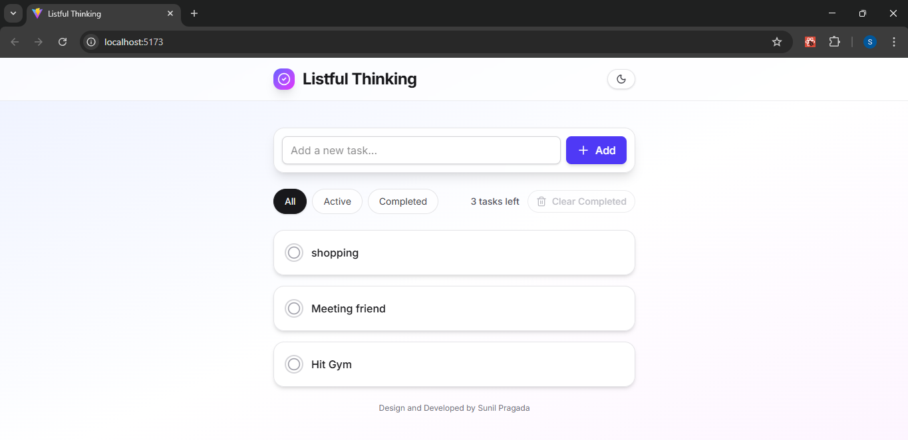
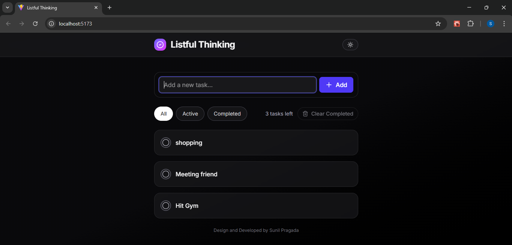

# 📝 Basic To‑Do App

A **modern, feature-rich To‑Do application** built with **React**, **Vite**, and **Tailwind CSS**.  
Easily manage tasks with **CRUD operations**, filter by tabs, search, and toggle between **Light/Dark themes**.  
All tasks and theme preferences are saved in **localStorage**, so your data persists across browser sessions.

---

## 🌟 Features

- **CRUD Operations:** Add, edit, delete tasks  
- **Tabs:** Filter tasks by **All / Active / Completed**  
- **Search:** Quickly find tasks by text  
- **Light/Dark Mode:** Switch themes at any time  
- **Persistence:** Tasks and theme saved in `localStorage`  
- **Responsive UI:** Works seamlessly on mobile and desktop

---

## 🛠 Tech Stack

- React
- Vite
- Tailwind CSS
- JavaScript
- HTML
- CSS

---

## ⚡ Usage

1. **Add Task:** Type in the input field and press **Add**.  
2. **Edit Task:** Click the **✏️ Edit** button next to a task, modify details, then click **Save**.  
3. **Delete Task:** Click the **✖** button to remove a task.  
4. **Toggle Task Status:** Check the box to mark a task as **completed** or **active**.  
5. **Filter Tasks:** Switch tabs to view **All / Active / Completed** tasks.  
6. **Search Tasks:** Type in the search bar to locate a task quickly.  
7. **Toggle Theme:** Click the top button to switch **Light/Dark mode**.  

---

## 📸 Screenshots

| Light Mode | Dark Mode |
|------------|-----------|
|  |  |

---

## 📂 Folder Structure

```text
src/
├─ components/
│  ├─ TaskItem.jsx
│  ├─ TaskForm.jsx
│  ├─ SearchBar.jsx
│  ├─ FilterTabs.jsx
│  └─ ProgressBar.jsx
├─ App.jsx
├─ main.jsx
└─ index.css

```


## 🚀 Installation & Run
Prerequisites
- Node.js (v16+ recommended)
- npm

1.Steps to Clone the repository
- git clone https://github.com/pragadasunil/Todo-Application.git

2.Navigate to project folder
- cd advanced-todo-app

3.Install dependencies
- npm install

4.Run the app (Vite dev server)
- npm run dev

Open your browser at http://localhost:5173 to see the app.

## 🔮 Future Enhancements
- Categories/Tags with colored badge
- Task priorities (High / Medium / Low)
- Due dates and optional notifications
- Drag & drop task reordering using @dnd-kit
- Swipe gestures for mobile: complete/delete tasks
- Progress tracking bar showing completion percentage

